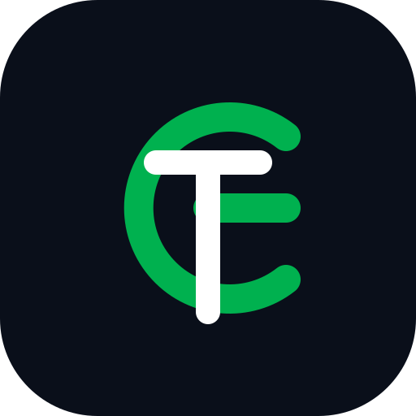

<p align="center">
  
</p>

<h1 align="center">GrabTrack</h1>

<p align="center">
  <b>Real-Time Telemetry & Share-Location Monitor untuk Grab</b><br>
  Pantau status pesanan, pergerakan driver, dan ETA langsung via Dashboard Web lokal & notifikasi instan Telegram.
</p>

<p align="center">
  
  
  
  
  
</p>

---

## 📌 Ringkasan

**GrabTrack** adalah monitoring tool personal yang bertugas memantau tautan `sharelocation.grab.com` secara terus-menerus di latar belakang (*background poller*). Setiap kali terjadi perubahan pada status pesanan (misalnya: dari persiapan dapur ke penugasan driver, pesanan diantar, hingga selesai/dibatalkan), lokasi koordinat driver, atau estimasi waktu tiba (ETA), GrabTrack akan:
1. Memperbarui status secara live di **Web Dashboard** lokal (refresh otomatis setiap 3 detik).
2. Mengirimkan **push notification** terstruktur ke bot Telegram Anda tanpa false alarm atau noise.


---

## ⚡ Fitur Utama

- **Polling & Deteksi Perubahan Otomatis:**
  - Mengambil data langsung dari endpoint safety telemetry Grab (`/api/v1/safety/sharemyride/...`).
  - Mendeteksi perbedaan (*delta tracking*) pada `state`, `driver_location`, `eta`, `booking_code`, dan `messageStatus`.
  - Riwayat perubahan (*audit trail*) tersimpan rapi per tautan hingga 50 entri terakhir.
- **Web Dashboard:**
  - **Pragmatic, Status-First UI:** Hirarki visual tajam, status langsung terbaca dalam <2 detik tanpa ornamen norak (*no AI slop*).
  - **Delivery Stepper:** Visualisasi 4 tahap perjalanan pesanan (Disiapkan → Driver Menuju Pickup → Sedang Diantar → Selesai/Tiba).
  - **Dark & Light Mode:** Mendukung tema gelap (*obsidian slate*) dan terang (*clean white*) dengan deteksi otomatis sistem serta tombol toggle manual.
  - **Peta Interaktif Live Driver (OpenStreetMap):** Pelacakan posisi driver secara visual dan real-time langsung di dalam kartu pesanan menggunakan Leaflet.js + OpenStreetMap tile. 100% gratis, bebas watermark, dan tanpa membutuhkan API Key!
  - **Keamanan Data (Base64 & SQLite):** Tautan dan token Grab dienkode dengan Base64 sebelum disimpan ke database SQLite (`grabtrack.db`) untuk menjaga privasi repositori.
  - **1-Click Copy & Link OSM:** Salin kode booking dan token share link dengan sekali klik, serta link langsung menuju koordinat di OpenStreetMap.
  - **Dukungan Keyboard Shortcut:** Tekan tombol `/` untuk langsung memfokuskan kursor ke input URL.
- **Push Notification Telegram:**
  - Format pesan HTML rapi dengan badge emoji, kode booking, rincian perubahan (`old` → `new`), dan link langsung ke OpenStreetMap saat koordinat driver berpindah.
  - Menggunakan raw HTTPS Telegram Bot API tanpa framework bot yang membengkak (*zero heavy dependencies*).
- **Mode Mock Bawaan:**
  - Uji coba visual dan fungsionalitas UI secara instan tanpa membutuhkan pesanan aktif (`?mock=1` atau `?mock=empty`).

---

## 🏗️ Arsitektur Sistem

```
┌─────────────────────────────────┐
│     Grab Share Location URL     │ (sharelocation.grab.com/o/<token>)
└────────────────┬────────────────┘
                 │
                 ▼
┌─────────────────────────────────┐
│       monitor.py (Poller)       │ ◄─── Periodic thread (default: 8 detik)
│  - extract_token()              │
│  - fetch_booking()              │
│  - detect_changes()             │
└────────┬───────────────┬────────┘
         │               │
  (on_events callback)   │ (monitor.status())
         │               │
         ▼               ▼
┌──────────────────┐   ┌───────────────────────────────────┐
│   notifier.py    │   │         app.py (Flask API)        │
│  - Telegram Bot  │   │  - GET    /api/status             │
│    Push Alerts   │   │  - POST   /api/links              │
└──────────────────┘   │  - DELETE /api/links/<token>      │
                       │  - GET    / (Dashboard Web)       │
                       └─────────────────┬─────────────────┘
                                         │
                                         ▼
                       ┌───────────────────────────────────┐
                       │      dashboard/index.html         │
                       │  - Live Polling UI (3 detik)      │
                       │  - Dark / Light Mode Switcher     │
                       │  - Delivery Progress Stepper      │
                       └───────────────────────────────────┘
```

---

## 🚀 Panduan Memulai

### 1. Prasyarat

- Python 3.10 atau versi yang lebih baru.
- Koneksi internet untuk polling API Grab dan Telegram.

### 2. Instalasi

Clone repositori dan pasang dependensi minimal yang dibutuhkan:

```bash
git clone https://github.com/username/grabtrack.git
cd grabtrack
pip install -r requirements.txt
```

> **Catatan Dependensi:** Hanya membutuhkan `flask` dan `requests`.

---

## ⚙️ Konfigurasi (`config.json`)

File `config.json` terletak di root folder:

```json
{
  "bot_token": "",
  "chat_id": "",
  "poll_interval": 8,
  "port": 8600
}
```

### Penjelasan Parameter:

| Parameter | Tipe | Default | Deskripsi |
| :--- | :--- | :--- | :--- |
| `bot_token` | `string` | `""` | Token bot dari [@BotFather](https://t.me/BotFather). Kosongkan jika hanya ingin menggunakan Web Dashboard. |
| `chat_id` | `string`/`number` | `""` | ID chat atau user Telegram penerima notifikasi. |
| `poll_interval`| `number` | `8` | Interval polling ke API Grab (dalam satuan detik). |
| `port` | `number` | `8600` | Port lokal untuk Web Dashboard. |

### Mendapatkan Token & Chat ID Telegram:

1. Buat bot baru di Telegram melalui [@BotFather](https://t.me/BotFather), lalu salin token API yang diberikan ke field `bot_token`.
2. Kirim pesan ke bot Anda atau ke [@userinfobot](https://t.me/userinfobot) untuk mendapatkan User ID / Chat ID Anda, lalu isi ke field `chat_id`.
3. Jalankan `python app.py` — bot akan otomatis aktif dan mengirimkan notifikasi setiap ada pembaruan status.

---

## 🖥️ Menjalankan Aplikasi

Jalankan perintah berikut di terminal:

```bash
python app.py
```

Output terminal:
```text
[app] http://127.0.0.1:8600  interval=8.0s  telegram=on
```

Buka browser Anda dan kunjungi:
👉 **`http://127.0.0.1:8600`**

### Uji Mandiri (*Selftest*)
Untuk memverifikasi koneksi Grab API, ekstraksi token, dan logic deteksi perubahan tanpa menjalankan server web:

```bash
python app.py --selftest
```

---

## 📋 Penggunaan & Format Link

1. Buka aplikasi **Grab** saat ada pesanan aktif (GrabFood, GrabMart, atau GrabBike/Car).
2. Ketuk tombol **Bagikan Perjalanan** / **Share Ride** / **Share Location**.
3. Salin tautan yang dihasilkan, contohnya:
   ```text
   https://sharelocation.grab.com/o/vgqBXep9zsxOKASSSRRf
   ```
4. Buka dashboard di browser, tempel URL pada input **Pantau Link Baru**, beri label opsional (misal: `"Makan Siang"`), lalu klik **Pantau** (atau tekan `Enter`).

> **Format yang didukung:**
> - URL lengkap: `https://sharelocation.grab.com/o/<token>`
> - URL dengan query parameter: `https://sharelocation.grab.com/o/<token>?source=share`
> - Bare token: `<token>`

---

## 🔌 Dokumentasi REST API

Backend menyediakan REST API internal:

### 1. `GET /api/status`
Mengembalikan status interval dan seluruh daftar tautan beserta data pantauan terkini.

**Respons (200 OK):**
```json
{
  "poll_interval": 8.0,
  "links": [
    {
      "token": "vgqBXep9zsxOKASSSRRf",
      "label": "Pesanan Irul",
      "url": "https://sharelocation.grab.com/o/vgqBXep9zsxOKASSSRRf",
      "state": "ORDER_IN_PREPARE",
      "driver_location": null,
      "eta": 1790166000,
      "booking_code": "A-9SCF9VVGX5DSAV",
      "last_poll": "2026-09-23T12:45:00+00:00",
      "last_change": "2026-09-23T11:45:00+00:00",
      "error": null,
      "history": [
        {
          "ts": "2026-09-23T11:45:00+00:00",
          "field": "state",
          "old": "CONFIRMED",
          "new": "ORDER_IN_PREPARE"
        }
      ]
    }
  ]
}
```

### 2. `POST /api/links`
Menambahkan link baru ke daftar pantauan.

**Payload:**
```json
{
  "url": "https://sharelocation.grab.com/o/vgqBXep9zsxOKASSSRRf",
  "label": "Pesanan Kantor"
}
```

### 3. `DELETE /api/links/<token>`
Menghapus token tertentu dari pemantauan berkala dan basis data SQLite (`grabtrack.db`).

---

## 🎨 Filosofi Desain (Anti-AI Slop)

GrabTrack dirancang dengan panduan desain tegas dari [`PRODUCT.md`](PRODUCT.md):

- **Status First:** Badge status dan delivery progress stepper adalah fokus hierarki nomor satu.
- **Earned Familiarity:** Desain UI tenang, presisi, dan fungsional terinspirasi dari standar Linear / Stripe.
- **Signal over Decoration:** Warna digunakan khusus untuk semantik status (Amber = Persiapan, Emerald Green = Pengantaran / Selesai, Rose Red = Pembatalan). Tidak ada gradien neon berlebihan atau elemen dekoratif palsu.
- **Quiet Density:** Data disajikan padat dan mudah dipindai dengan font monospace khusus untuk koordinat, kode booking, dan timestamp teknis.

---

## 📂 Struktur Berkas

```text
grabtrack/
├── .gitignore                 # Konfigurasi ignore git (Python, SQLite, IDE, HAR)
├── app.py                     # Entrypoint: Flask server, routing API, & poller thread
├── monitor.py                 # Engine polling Grab & layer persistensi SQLite
├── notifier.py                # Klien Telegram Bot API & pemformat pesan HTML
├── config.json                # Pengaturan lokal (token Telegram, port, interval)
├── grabtrack.db               # Basis data SQLite (auto-generated, gitignored)
├── requirements.txt           # Dependensi Python minimal (flask, requests)
├── logo.svg                   # Logo vektor geometric GrabTrack
├── PRODUCT.md                 # Spesifikasi prinsip produk & aturan desain
├── README.md                  # Dokumentasi resmi proyek
├── dashboard/
│   ├── index.html             # Web dashboard lengkap (Dark/Light mode & live poller)
│   ├── logo.svg               # Salinan aset logo untuk web
│   ├── _mock.html             # Pintasan mode mock pengujian
│   └── dashboard-desktop.png  # Tangkapan layar antarmuka dashboard
└── docs/
    ├── screenshots/           # Tangkapan layar QA & visual
    ├── sharelocation.grab.com-analysis.md # Analisis API & HAR Grab
    └── sharelocation.grab.com.har         # Raw HAR network dump
```

---

## 📄 Lisensi

Didistribusikan di bawah lisensi MIT. Bebas digunakan dan dimodifikasi untuk kebutuhan monitoring pribadi.
